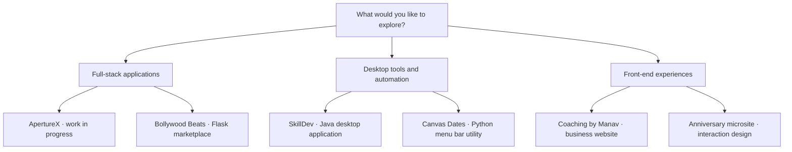
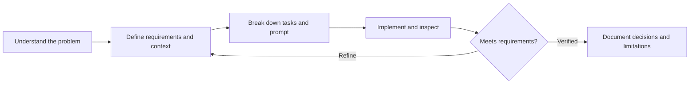

# Hi, I'm Zain 👋

I'm a **Computer Science student at Queensland University of Technology**, based in Brisbane. I build software that turns everyday problems into clear, useful workflows — from desktop tools and Python automation to database-backed web applications.

**Seeking a computer science or software engineering internship.** My focus is coding, practical problem solving and learning from an engineering team.

[Explore my projects](#project-directory) · [How I work](#how-i-work) · [LinkedIn](https://www.linkedin.com/in/zain-khokhar-9a3b4a3a5/) · [Email](mailto:khokharzain001@gmail.com)

## Start here

| If you're interested in… | Take a look at… |
| --- | --- |
| Full-stack development and server-side validation | **[ApertureX](projects/aperturex.md)** — enquiry management, an admin dashboard and security checks; work in progress |
| Java, relational persistence and collaborative development | **[SkillDev](https://github.com/khokharzain/CAB302-)** — a skill-exchange desktop application |
| A real business website and thoughtful front-end interactions | **[Coaching by Manav](https://github.com/khokharzain/coaching-by-manav)** — responsive design, an interactive gallery and booking handoff |
| Python web applications and booking workflows | **[Bollywood Beats](https://github.com/harrybhatiadevs/IAB207-A2)** — an event marketplace developed with a university team |

## Project directory

Every project below has an explanation and flowcharts. Public repositories also include setup instructions and implementation notes. Team projects distinguish my contributions from the application's overall capabilities.

| Project | What it does | Technologies · status |
| --- | --- | --- |
| **[ApertureX](projects/aperturex.md)** | A photography-business platform with public enquiry forms and authenticated administration | TypeScript, React, React Router, Cloudflare Workers, D1 · **work in progress; private source, public overview** |
| **[SkillDev](https://github.com/khokharzain/CAB302-)** | Connects people who want to teach and learn skills through profiles, posts, requests and messages | Java 21, JavaFX, SQLite/JDBC, JUnit, optional Ollama · university team project |
| **[Coaching by Manav](https://github.com/khokharzain/coaching-by-manav)** | Presents a coaching service and guides visitors to Square Appointments | HTML, CSS, JavaScript, Cloudflare · [live website](https://coachingbymanav.com.au) |
| **[Bollywood Beats](https://github.com/harrybhatiadevs/IAB207-A2)** | Lets attendees discover and book events, and organisers manage listings | Python, Flask, SQLAlchemy, SQLite, Bootstrap · university team project; simulated payments |
| **[Canvas Dates](https://github.com/khokharzain/canvas-dates)** | Puts assessment deadlines and grade weightings in the macOS menu bar | Python, rumps, calendar/API ingestion, local persistence · macOS utility |
| **[Interactive Anniversary Microsite](https://github.com/khokharzain/for-my-aloo)** | Explores animated scenes, a typed-message reveal, browser audio and gallery interactions | HTML, CSS, JavaScript, Web Crypto · personal front-end experiment |

### A map of the portfolio

## How I work

**AI prompting is one of my strongest skills.** I use structured instructions, relevant context, task decomposition and iterative refinement to turn broad ideas into manageable coding tasks. I check generated output against the source, requirements and available tests, and take responsibility for the result.

| Strength | How it appears in my work |
| --- | --- |
| AI prompting | Clear constraints, contextual instructions, iterative refinement and output verification |
| Software development | Python, Java, TypeScript/JavaScript, SQL, HTML/CSS and database-backed workflows |
| Engineering judgement | Separating UI, validation and persistence; documenting what works and what remains planned |
| Leadership and communication | My **PUMA Sales Managing Supervisor** experience developed team coordination, coaching and customer problem solving |

## Evidence and scope

Checks run on **1 October 2026**: SkillDev's **86 JUnit tests**, Canvas Dates' **56 offline checks**, and ApertureX's **75 security checks** passed. ApertureX's client-boundary check also passed. These are specific checks, not a claim that every application has a complete automated test suite or production certification. Each project explains its own limitations.

I'm especially interested in **software engineering, Python automation, web applications and AI-assisted development**. I'd welcome the chance to contribute, learn and build useful systems with a team.
