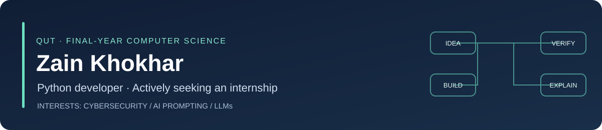
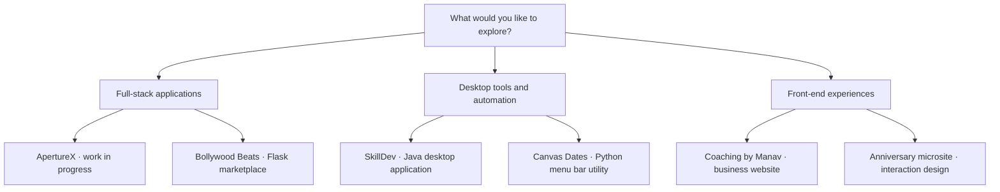
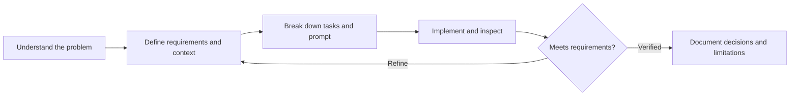

# Hi, I'm Zain 👋

I'm a **final-year Bachelor of Information Technology student, majoring in Computer Science at Queensland University of Technology**, based in Brisbane. **Python is my strongest programming language** — I enjoy building automation, useful desktop tools and database-backed web applications.

**I'm actively searching for a computer science or software engineering internship.** My strongest areas of interest are **cybersecurity, AI prompting and large language models (LLMs)**, alongside practical software development.

[Explore my projects](#project-directory) · [Technical skills](#technical-skills) · [Algorithms and data structures](projects/engineering.md) · [LinkedIn](https://www.linkedin.com/in/zain-khokhar-9a3b4a3a5/) · [Email](mailto:khokharzain001@gmail.com)

## My academic foundation

My degree has given me coursework experience in **cybersecurity and secure network architectures, cloud computing, web development, database management, algorithms and complexity, machine learning, and agile software engineering**. I'm interested in applying these foundations to real software problems and continuing to develop them through an internship.

## Start here

| If you're interested in… | Take a look at… |
| --- | --- |
| Full-stack development and server-side validation | **[ApertureX](projects/aperturex.md)** — enquiry management, an admin dashboard and security checks; work in progress |
| Java, relational persistence and collaborative development | **[SkillDev](https://github.com/khokharzain/CAB302-)** — a skill-exchange desktop application |
| A real business website and thoughtful front-end interactions | **[Coaching by Manav](https://github.com/khokharzain/coaching-by-manav)** — responsive design, an interactive gallery and booking handoff |
| Python web applications and booking workflows | **[Bollywood Beats](https://github.com/harrybhatiadevs/IAB207-A2)** — an event marketplace developed with a university team |

## Project directory

Every project below has an explanation and flowcharts. Public repositories also include setup instructions and implementation notes. Team projects distinguish my contributions from the application's overall capabilities.

| Project | What it does | Technologies · status |
| --- | --- | --- |
| **[ApertureX](projects/aperturex.md)** | A photography-business platform with public enquiry forms and authenticated administration | TypeScript, React, React Router, Cloudflare Workers, D1 · **work in progress; private source, public overview** |
| **[SkillDev](https://github.com/khokharzain/CAB302-)** | Connects people who want to teach and learn skills through profiles, posts, requests and messages | Java 21, JavaFX, SQLite/JDBC, JUnit, optional Ollama · university team project |
| **[Coaching by Manav](https://github.com/khokharzain/coaching-by-manav)** | Presents a coaching service and guides visitors to Square Appointments | HTML, CSS, JavaScript, Cloudflare · [live website](https://coachingbymanav.com.au) |
| **[Bollywood Beats](https://github.com/harrybhatiadevs/IAB207-A2)** | Lets attendees discover and book events, and organisers manage listings | Python, Flask, SQLAlchemy, SQLite, Bootstrap · university team project; simulated payments |
| **[Canvas Dates](https://github.com/khokharzain/canvas-dates)** | Puts assessment deadlines and grade weightings in the macOS menu bar | Python, rumps, calendar/API ingestion, local persistence · macOS utility |
| **[Interactive Anniversary Microsite](https://github.com/khokharzain/for-my-aloo)** | Explores animated scenes, a typed-message reveal, browser audio and gallery interactions | HTML, CSS, JavaScript, Web Crypto · personal front-end experiment |

### A map of the portfolio

## Technical skills

| Area | Skills and experience |
| --- | --- |
| Primary language | **Python** — automation, data processing and web applications |
| Other project languages | Java, TypeScript, JavaScript, SQL, HTML and CSS; FXML for JavaFX interfaces and shell scripts for supporting tooling |
| Additional coursework languages | C# and embedded C |
| Web and desktop development | Flask, SQLAlchemy, Jinja, Bootstrap, React, React Router, JavaFX and rumps |
| Databases and persistence | SQLite, Cloudflare D1, JDBC/DAO architecture, relational models, prepared statements, migrations, JSON storage and offline caching |
| Algorithms and data structures | Lists/arrays, dictionaries/maps, sets, sorting/filtering, parsing, aggregation, state transitions and relational data modelling — [project-by-project examples](projects/engineering.md) |
| Cybersecurity foundations | Coursework in cybersecurity and secure networks; project work with input validation, rate limiting, JWT verification, security headers and platform cryptographic APIs |
| AI prompting and LLMs | Structured prompts, context and constraints, task decomposition, iterative refinement and output verification; local Ollama integration in the SkillDev team application |
| Cloud and delivery | Cloudflare Workers, static-assets hosting and D1; AWS and cloud-computing coursework |
| Data and machine learning coursework | Pandas, NumPy, Jupyter Notebook and machine-learning foundations |
| Development tools | Git, GitHub, Maven, JUnit, Visual Studio Code and automated checks |

### Techniques behind the projects

| Project | Languages | Data structures and algorithms in the application |
| --- | --- | --- |
| Canvas Dates | **Python**, supporting shell scripts | Dictionary lookups, lists of assessment records, iCalendar parsing, date sorting, filtering, weighted aggregation and caching |
| SkillDev | Java, SQL, FXML | Lists/ArrayLists, sets for deduplication, skill-match scoring, score sorting and relational joins |
| ApertureX | TypeScript, SQL, HTML/CSS through React | Typed records, arrays, allowlist sets, SQL filtering/pagination, fixed-window rate limiting and JWT verification |
| Bollywood Beats | Python, SQL, HTML/CSS, JavaScript | Relational entities, catalogue filtering/sorting, capacity aggregation, status rules and Decimal price calculations |
| Coaching by Manav | JavaScript, HTML/CSS | Element collections, gallery state, frame-based animation, scroll-position wrapping and batched updates |
| Anniversary microsite | JavaScript, HTML/CSS | Arrays and gallery indices, scene state transitions, date arithmetic and browser SHA-256 digest comparison |

[Explore the implementation examples and source guide →](projects/engineering.md)

## How I work

**AI prompting is one of my strongest skills.** I use structured instructions, relevant context, task decomposition and iterative refinement to turn broad ideas into manageable coding tasks. I check generated output against the source, requirements and available tests, and take responsibility for the result.

| Strength | How it appears in my work |
| --- | --- |
| Python | Automation, calendar/API data processing, grade-weight calculations and Flask applications |
| AI prompting | Clear constraints, contextual instructions, iterative refinement and output verification |
| Software development | Python, Java, TypeScript/JavaScript, SQL, HTML/CSS and database-backed workflows |
| Engineering judgement | Separating UI, validation and persistence; documenting what works and what remains planned |
| Leadership and communication | My **PUMA Sales Managing Supervisor** experience developed team coordination, coaching and customer problem solving |

## Evidence and scope

Checks run on **1 October 2026**: SkillDev's **86 JUnit tests**, Canvas Dates' **56 offline checks**, and ApertureX's **75 security checks** passed. ApertureX's client-boundary check also passed. These are specific checks, not a claim that every application has a complete automated test suite or production certification. Each project explains its own limitations.

I'm looking for an internship where I can contribute through **Python and software development**, explore **cybersecurity and LLM applications**, and learn from an engineering team. [Let's connect on LinkedIn](https://www.linkedin.com/in/zain-khokhar-9a3b4a3a5/).
