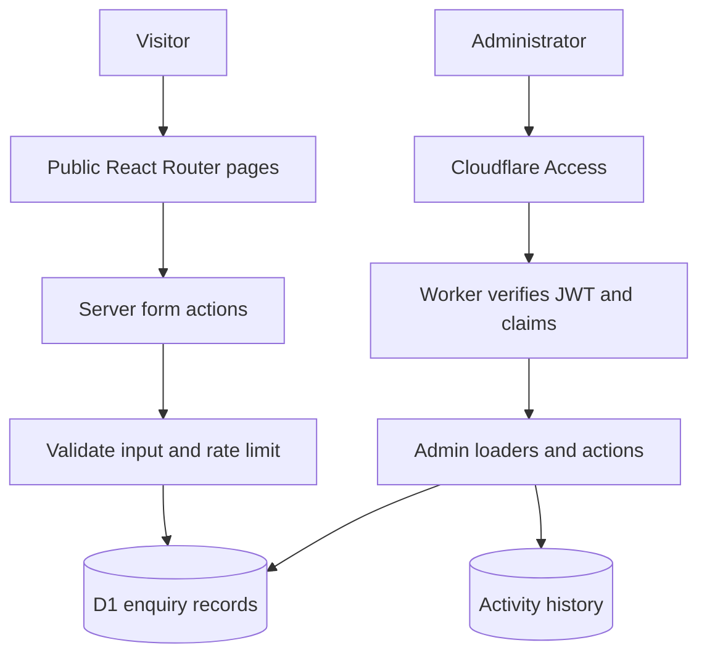
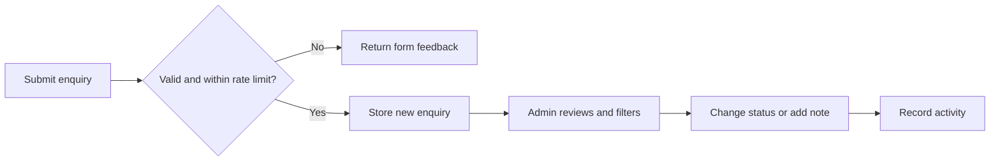

# ApertureX

**A photography-business platform · TypeScript, React, React Router, Cloudflare Workers and D1**

**Work in progress. The source repository is private.** This public overview explains the project without requiring repository access. It distinguishes implemented workflows from planned integrations.

[← Back to Zain's portfolio](../README.md)

## The problem

A photography business needs a clear way to present its work, collect enquiries and track follow-up. ApertureX brings the public website and administrative enquiry workflow into one application, with server-side validation and persistent records.

## Implemented so far

- Public portfolio, service, booking-enquiry and contact pages.
- Server-side input validation, honeypot checks and database-backed rate limiting.
- D1 persistence with prepared statements and SQL migrations.
- An admin dashboard with enquiry filtering, pagination, status updates and internal notes.
- Cloudflare Access JWT signature and claim verification for administrative requests.
- Activity history, per-response content-security-policy nonces and security headers.

## Architecture

Administrative loaders and actions verify authorisation individually. Public form handling and admin data access have separate server modules, and SQL values are bound through prepared statements.

## An enquiry from start to finish

## Validation and current limits

On 1 October 2026, **75 dependency-free security checks passed**, covering input validation, token/PIN hashing, Access JWT rejection cases and cookie parsing. A separate check found no server-only imports reachable from browser code. These checks do not establish production readiness or validate live payments, D1 concurrency or media delivery.

| Present | Planned |
| --- | --- |
| Booking enquiries and administrative follow-up | Payment checkout and webhook reconciliation |
| Gallery-related schema and security primitives | Private gallery routes and authorised media delivery |
| Portfolio pages and enquiry management | Media upload, delivery notifications and expiry jobs |

The current gallery route is an information page. Payment and private media-delivery integrations are **not complete**.

## My role

I am developing the application, enquiry-management workflows and server-side validation/security foundations. The project gives me practical experience connecting a React interface, server actions, authentication and relational persistence while documenting unfinished work honestly.

Private code and environment configuration are not included in this public overview.
